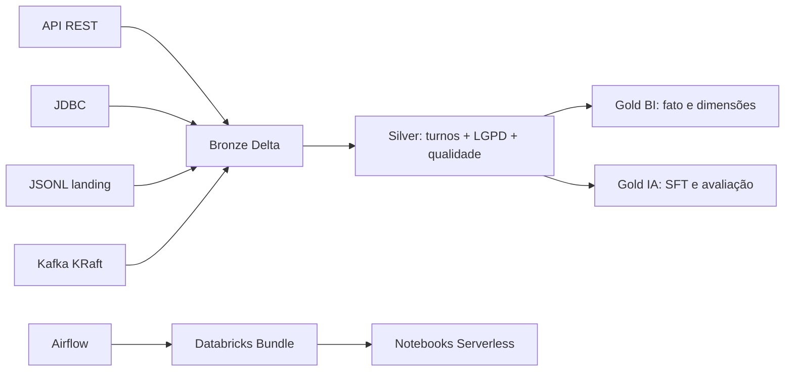

# Lakehouse Conversacional para IA

[](https://github.com/PAULOTEK/Llms-chatbot/releases)

Projeto-portfólio de Engenharia de Dados para ingestão, tratamento LGPD,
governança e preparação de dados conversacionais para BI e LLMs.

## Arquitetura



## Requisitos da vaga e implementação

| Requisito | Implementação |
|---|---|
| ETL/ELT e Spark | `src/conversas_ia/transformacao`, notebooks sequenciais |
| Databricks/Delta/Unity Catalog | `databricks.yml`, `resources/`, `sql/01_catalogo_schemas.sql` |
| APIs, bancos e arquivos | `ingestao/api_conversas.py`, `jdbc.py`, `arquivos_jsonl.py` |
| Airflow e Docker | `airflow/dags/`, `airflow/docker-compose.yml` |
| SQL avançado | `sql/analytics/` com CTEs, janelas e `levenshtein` |
| Qualidade e quarentena | `qualidade/`, regras YAML, notebook 03 |
| Governança e linhagem | `comum/linhagem.py`, `docs/linhagem.md`, tags UC |
| LGPD/anonimização | `privacidade/`, `docs/governanca_lgpd.md` |
| Datasets LLM | `gold_datasets_ia.py`: SFT e splits determinísticos |
| Kafka/near real-time | `streaming/kafka_bronze.py`, Structured Streaming e Silver `foreachBatch` |
| Git/CI/CD | `.github/workflows/ci.yml` e `cd.yml` |

## Execução local

```bash
python3 -m venv .venv
source .venv/bin/activate
pip install -e '.[dev]'
ruff check .
black --check .
pytest -q
```

Os testes usam Spark local puro e não exigem Delta ou Databricks.

## Airflow

```bash
cd airflow
cp .env.example .env
docker compose up airflow-init
docker compose up -d
```

Configure a conexão `databricks_default` com host/token no Airflow. O DAG
dispara uma única execução do job completo do bundle com
`DatabricksRunNowOperator`; as cinco etapas permanecem encadeadas dentro do
Databricks. Se o provider não estiver instalado, o fallback explícito permite
compilar e executar uma simulação local.

## Deploy Databricks

```bash
databricks bundle validate -t dev
databricks bundle deploy -t dev
databricks bundle run job_conversas_ia -t dev
```

Configure `DATABRICKS_HOST` como **Variable ou Secret** e
`DATABRICKS_TOKEN` como **Secret**. Targets: `dev`, `hml`, `prd`.

No GitHub Actions, o workflow `CD Databricks` também pode ser disparado
manualmente em **Actions → CD Databricks → Run workflow**. Marque
`executar_job` para executar `job_conversas_ia` no Serverless imediatamente
após o deploy; deixe desmarcado para somente publicar o Bundle.

## Estrutura

```text
config/          ambientes, pipeline e regras de qualidade
src/             pacote Python com ingestão, privacidade e transformações
notebooks/       cinco etapas Databricks parametrizadas
resources/       job do Databricks Asset Bundle
airflow/         DAG, Dockerfile, Compose e variáveis
sql/             DDL Unity Catalog e analytics
tests/           testes Spark locais
docs/            arquitetura, LGPD, qualidade, ADRs e linhagem
streaming/       Kafka KRaft local e produtor sintético
```

Detalhes da camada near real-time estão em [`docs/streaming.md`](docs/streaming.md).
A política de versões e releases está em [`docs/versionamento.md`](docs/versionamento.md).
