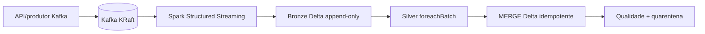

# Streaming near real-time

## Arquitetura

Adotamos uma arquitetura **kappa** para eventos conversacionais: Kafka é a
entrada contínua e Delta Lake é o armazenamento replayable. O mesmo pacote
PySpark fornece funções puras para batch e `foreachBatch`, evitando duas regras
de negócio divergentes.



O job Databricks usa `availableNow` a cada 15 minutos. Essa escolha é adequada
ao Serverless, processa o backlog disponível e encerra o micro-batch, evitando
manter um cluster contínuo ocioso.

O job Databricks só funciona quando `bootstrap_servers` aponta para um broker
Kafka acessível a partir da rede do workspace. O Kafka de desenvolvimento não
é exposto automaticamente ao Databricks; portanto, a demonstração
near real-time executável e reproduzível deste projeto usa o Docker Compose
local abaixo. Não se deve interpretar o recurso Databricks como um broker
gerenciado ou acessível sem configuração adicional de rede.

## Exactly-once e idempotência

O checkpoint do Structured Streaming registra offsets Kafka processados.
Na Silver, o `MERGE` usa `(conversa_id, turno_id)` como chave natural, portanto
reprocessamentos do mesmo micro-batch não duplicam turnos. A semântica
end-to-end depende de checkpoint persistente, Delta transacional e consumidores
sem efeitos externos não idempotentes.

## Backpressure e late data

`maxOffsetsPerTrigger` limita a quantidade lida por execução. O watermark
configurável (`10 minutes` no desenvolvimento) combinado com
`dropDuplicates` limita estado e descarta eventos mais antigos que a janela.
Eventos tardios devem ser monitorados por métricas de lag; se a regra de negócio
exigir correção histórica, reexecute uma janela batch a partir do Bronze.

## Custos e operação local

`availableNow` reduz custo em relação a um cluster contínuo para tráfego
intermitente. Para tráfego constante, `processingTime=<intervalo>` pode ser
mais eficiente. Kafka local roda em KRaft sem ZooKeeper:

```bash
docker compose -f streaming/docker-compose.yml up -d
pip install -e '.[streaming]'
python scripts/produtor_sintetico.py --quantidade 10
```

O conector `pyspark-sql-kafka` é fornecido pelo runtime Databricks e deve ser
adicionado como dependência do compute quando necessário; não é instalado no
wheel nem nos testes locais.
